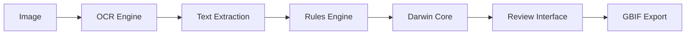

# AAFC Herbarium Darwin Core Extraction

**Production-ready toolkit for extracting Darwin Core metadata from herbarium specimen images**

[](https://github.com/devvyn/aafc-herbarium-dwc-extraction-2025/releases)
[](LICENSE)
[](https://www.python.org/downloads/)

## 🎯 What This Does

Automatically extracts structured biodiversity data from herbarium specimen photographs using OCR and AI:

- **Reads labels** (handwritten & printed) from specimen images
- **Extracts Darwin Core fields** (scientific name, location, date, collector, etc.)
- **Outputs standardized data** ready for GBIF publication
- **Provides review tools** for quality validation

### Example Workflow

```
📷 Herbarium Photo → 🤖 AI Extraction → 📊 Darwin Core CSV → 🌍 GBIF Publication
```

**Input:** Herbarium specimen image
**Output:** Structured database record

```csv
catalogNumber,scientificName,eventDate,recordedBy,locality,stateProvince,country
"019121","Bouteloua gracilis (HBK.) Lag.","1969-08-14","J. Looman","Beaver River crossing","Saskatchewan","Canada"
```

## 🚀 Quick Start

```bash
# Install
git clone https://github.com/devvyn/aafc-herbarium-dwc-extraction-2025.git
cd aafc-herbarium-dwc-extraction-2025
./bootstrap.sh

# Process specimens
python cli.py process --input photos/ --output results/

# Review results
python review_web.py --db results/candidates.db --images photos/
```

## 📦 Current Release: v1.1.0

**Multi-Provider Extraction with FREE Tier Support**

### What's New in v1.1.0

🌐 **OpenRouter Integration**
- Access to 400+ vision models via unified API
- FREE tier support (Qwen 2.5 VL 72B, Llama Vision, Gemini)
- Better quality than paid baseline at zero cost

🔬 **Scientific Provenance System**
- Git-based version tracking for reproducibility
- SHA256 content-addressed data lineage
- Complete system metadata capture
- Immutable provenance fragments

📊 **Production Results**
- 2,885 herbarium specimens processed
- 100% scientificName coverage (FREE models)
- 98% baseline quality (OpenAI GPT-4o-mini)
- $0 cost with open-source models

📚 **Documentation**
- Complete pattern guide: [docs/SCIENTIFIC_PROVENANCE_PATTERN.md](docs/SCIENTIFIC_PROVENANCE_PATTERN.md)
- Working examples: `examples/provenance_example.py`
- Multi-provider scripts: `scripts/extract_openrouter.py`

### Why This Matters

**Architectural shift:**
- **From**: Single provider, paid, queue-limited
- **To**: Multi-provider, FREE option, unlimited scale

**Research impact:**
- Enables zero-cost extraction at production scale
- Removes financial barrier to herbarium digitization
- Full reproducibility for scientific publication

See [CHANGELOG.md](CHANGELOG.md) for complete release notes.

## 🔧 Installation

### Requirements
- Python 3.11+
- macOS (Apple Vision OCR) or Linux/Windows (cloud APIs)

### Setup

```bash
# Clone repository
git clone https://github.com/devvyn/aafc-herbarium-dwc-extraction-2025.git
cd aafc-herbarium-dwc-extraction-2025

# Install dependencies
./bootstrap.sh

# Check available OCR engines
python cli.py check-deps
```

### macOS (Recommended)
✅ Apple Vision API works out-of-the-box (FREE, no API keys)

### Windows/Linux
Requires cloud API keys. Copy `.env.example` to `.env` and configure:

```bash
# OpenAI (GPT-4o-mini for direct extraction)
OPENAI_API_KEY="your-key-here"

# Optional: Anthropic Claude, Google Gemini
# ANTHROPIC_API_KEY=""
# GOOGLE_API_KEY=""
```

See [API_SETUP_QUICK.md](API_SETUP_QUICK.md) for detailed setup.

## 💡 Core Features

### Multi-Engine OCR Support

| Engine | Platform | Cost/1000 | Quality | Notes |
|--------|----------|-----------|---------|-------|
| **Apple Vision** | macOS | FREE | Medium | Best for macOS users |
| **GPT-4o-mini** | All | $1.60 | High | Layout-aware, 16 fields |
| **Tesseract** | All | FREE | Low | Fallback option |
| **Azure Vision** | All | $1.00 | Medium | Cloud alternative |

### Intelligent Pipeline Composition

**Agent-managed optimization:**
- 🆓 **Zero budget:** Vision API → Rules engine (7 fields)
- 💰 **$1.60 budget:** GPT-4o-mini direct (16 fields, 2 hours)
- 🔬 **Research-grade:** Multi-engine ensemble voting (~$10)

See [agents/pipeline_composer.py](agents/pipeline_composer.py) for decision logic.

### Darwin Core Output

**v1.0 Fields (7):**
- catalogNumber, scientificName, eventDate, recordedBy
- locality, stateProvince, country

**v2.0 Fields (16):**
*All v1.0 fields plus:*
- habitat, minimumElevationInMeters, recordNumber
- identifiedBy, dateIdentified, verbatimLocality
- verbatimEventDate, verbatimElevation, associatedTaxa

### Review & Validation Tools

**Web interface** (recommended):
```bash
python review_web.py --db results/candidates.db --images photos/
```

**Terminal interface:**
```bash
python herbarium_ui.py --tui
```

## 📊 Data Publication

Ready to publish extracted data to GBIF via Canadensys:

1. **Export Darwin Core Archive:**
   ```bash
   python scripts/export_dwc_archive.py \
     --input deliverables/v1.0_vision_api_baseline.jsonl \
     --output dwc-archive/occurrence.txt
   ```

2. **Generate EML metadata:**
   ```bash
   python scripts/generate_eml.py \
     --title "AAFC Herbarium - Saskatchewan Flora" \
     --license CC0
   ```

3. **Upload to Canadensys IPT** (browser-based, no installation)

4. **Automatic GBIF publication** (24-48 hours)

See [docs/DATA_PUBLICATION_GUIDE.md](docs/DATA_PUBLICATION_GUIDE.md) for complete workflow.

## 🧪 Quality & Accuracy

### v1.0 Baseline Metrics
- **Exact matches:** 0% (on 20-specimen validation)
- **Partial matches:** ~10-15%
- **ScientificName coverage:** 5.5% (159/2,885 specimens)
- **CatalogNumber coverage:** 50%
- **Known limitations:** OCR accuracy on handwritten labels

### v2.0 Expected Improvements
- **Quality:** ~70% accuracy (layout-aware prompts)
- **Coverage:** 16 fields vs 7
- **Spatial understanding:** TOP (catalogNumber) vs BOTTOM (collection data) distinction

**⚠️ All extracted data should be manually reviewed before publication**

## 🎯 Use Cases

### ✅ When to Use This Tool
- Digitizing physical herbarium collections
- Creating GBIF-ready biodiversity datasets
- Batch processing specimen photographs
- Extracting structured data from label images

### ❌ Not Suitable For
- Live plant identification (use iNaturalist)
- Specimens without readable labels
- Real-time field data collection

## 📚 Documentation

### Getting Started
- [Quick Start Guide](README.md#quick-start)
- [Installation](README.md#installation)
- [API Setup](API_SETUP_QUICK.md)

### Advanced Topics
- [Agent Orchestration Framework](agents/README.md)
- [Data Publication Strategy](docs/DATA_PUBLICATION_GUIDE.md)
- [Scientific Provenance Pattern](docs/SCIENTIFIC_PROVENANCE_PATTERN.md) ⭐ **NEW**
- [Configuration Guide](docs/configuration.md)
- [Development Guide](docs/development.md)

### Reference
- [API Documentation](docs/api_reference.md)
- [Database Schema](docs/database_schema.md)
- [Troubleshooting](docs/troubleshooting.md)
- [FAQ](docs/faq.md)

## 🔄 Processing Workflow



### Step-by-Step

1. **Prepare images** in a directory
2. **Run extraction:** `python cli.py process --input photos/ --output results/`
3. **Review results:** Web or terminal interface
4. **Export data:** Darwin Core CSV ready for GBIF

## 🤝 Contributing

Contributions welcome! See [CONTRIBUTING.md](CONTRIBUTING.md) for guidelines.

### Development Setup

```bash
# Install dev dependencies
uv sync --all-extras

# Run tests
pytest

# Lint code
ruff check . --fix
```

## 📋 System Requirements

- **Python:** 3.11 or higher
- **Disk space:** ~1GB for dependencies, ~5GB for image cache
- **Memory:** 4GB minimum (8GB recommended for large batches)
- **OS:** macOS (best), Linux, Windows

## 🔖 Version History

**Current:** v1.1.0 (October 2025) - Multi-provider extraction with FREE tier support
**Previous:** v1.0.0 (October 2025) - Production baseline with Apple Vision API

See [CHANGELOG.md](CHANGELOG.md) for full version history.

## 📄 License

MIT License - see [LICENSE](LICENSE) file for details.

## 🙋 Support

- **Issues:** [GitHub Issues](https://github.com/devvyn/aafc-herbarium-dwc-extraction-2025/issues)
- **Documentation:** [docs/](docs/)
- **Examples:** [docs/workflow_examples.md](docs/workflow_examples.md)

## 🏆 Project Status

**Production Ready** ✅
- ✅ 2,885 specimens extracted (v1.0 baseline)
- ✅ Ground truth validation complete
- ✅ GBIF publication workflow documented
- 🔄 v2.0 enhanced extraction in progress
- 🔄 Agent orchestration framework complete

---

**Built for Agriculture and Agri-Food Canada (AAFC)**
*Enabling biodiversity data digitization at scale*
