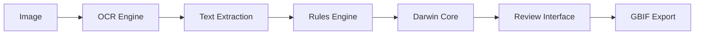

# AAFC Herbarium Darwin Core Extraction

**Production-ready toolkit for extracting Darwin Core metadata from herbarium specimen images**

[](https://github.com/devvyn/aafc-herbarium-dwc-extraction-2025/releases/tag/v2.0.0)
[](LICENSE)
[](https://www.python.org/downloads/)
[](https://aafc.devvyn.ca)

---

> **📚 [View Full Documentation](https://aafc.devvyn.ca)** - Complete guides, tutorials, and API reference

---

## 📥 Download Extracted Dataset

**🧪 Preview/Beta Release - 2,702 Herbarium Specimens**

Get immediate access to extracted Darwin Core data from AAFC specimens:

| Format | Size | Best For | Download |
|--------|------|----------|----------|
| **CSV** | 606 KB | Spreadsheets, R, Python | [occurrence.csv](https://data.devvyn.ca/aafc/herbarium/latest/occurrence.csv) |
| **Darwin Core Archive** | 168 KB | GBIF, biodiversity platforms | [dwc-archive.zip](https://data.devvyn.ca/aafc/herbarium/latest/dwc-archive.zip) |
| **JSONL** | 2.5 MB | API integration, confidence scores | [raw.jsonl](https://data.devvyn.ca/aafc/herbarium/latest/raw.jsonl) |

📖 **[Full Dataset Documentation →](https://data.devvyn.ca/aafc/herbarium/)**

⚠️ **Disclaimer**: This is a PREVIEW dataset extracted via OCR + AI. NOT manually verified. Expect ~70-80% accuracy on core fields. Use for research/testing only, not taxonomic decisions.

---

## 🎯 What This Does

Automatically extracts structured biodiversity data from herbarium specimen photographs using OCR and AI:

- **Reads labels** (handwritten & printed) from specimen images
- **Extracts Darwin Core fields** (scientific name, location, date, collector, etc.)
- **Outputs standardized data** ready for GBIF publication
- **Provides review tools** for quality validation

### Example Workflow

```
📷 Herbarium Photo → 🤖 AI Extraction → 📊 Darwin Core CSV → 🌍 GBIF Publication
```

**Input:** Herbarium specimen image
**Output:** Structured database record

```csv
catalogNumber,scientificName,eventDate,recordedBy,locality,stateProvince,country
"019121","Bouteloua gracilis (HBK.) Lag.","1969-08-14","J. Looman","Beaver River crossing","Saskatchewan","Canada"
```

## 🚀 Quick Start

```bash
# Install
git clone https://github.com/devvyn/aafc-herbarium-dwc-extraction-2025.git
cd aafc-herbarium-dwc-extraction-2025
./bootstrap.sh

# Process specimens
python cli.py process --input photos/ --output results/

# Review results (Quart web app)
python -m src.review.web_app --extraction-dir results/ --port 5002
```

## 📦 Current Release: v2.0.0

**Specimen-Centric Provenance Architecture**

### What's New in v2.0.0

🔬 **Specimen Provenance System**
- Complete lineage tracking from raw images through all transformations
- Automatic deduplication at (image_sha256, extraction_params) level
- Multi-extraction aggregation for improved field candidates
- Content-addressed storage with S3 integration

📊 **Production-Ready Infrastructure**
- Async web framework (Quart) for high-performance review
- Docker containerization for reproducible deployments
- Clean 8MB repository (97% size reduction from v1.x)
- Migration tools with full rollback capability

🎯 **Quality & Efficiency**
- Confidence-weighted field aggregation across extraction runs
- Review workflow with specimen-level tracking
- Progressive publication: draft → batches → final
- Full backward compatibility with v1.x data

📚 **Documentation & Migration**
- Complete release plan: [docs/RELEASE_2_0_PLAN.md](docs/RELEASE_2_0_PLAN.md)
- Migration guide with safety guarantees
- GBIF validation integration roadmap (v2.1.0)
- Specimen provenance architecture doc

### Why This Matters

**Architectural shift:**
- **From**: Image-centric processing (lost specimen identity)
- **To**: Specimen-centric provenance (complete lineage tracking)

**Research impact:**
- Enables reproducible extraction pipelines
- Supports iterative improvement with safety
- Production-ready data quality management
- Foundation for GBIF-validated publication (v2.1.0)

See [CHANGELOG.md](CHANGELOG.md) for complete release notes.

## 🔧 Installation

### Requirements
- Python 3.11+
- macOS (Apple Vision OCR) or Linux/Windows (cloud APIs)

### Setup

```bash
# Clone repository
git clone https://github.com/devvyn/aafc-herbarium-dwc-extraction-2025.git
cd aafc-herbarium-dwc-extraction-2025

# Install dependencies
./bootstrap.sh

# Check available OCR engines
python cli.py check-deps
```

### macOS (Recommended)
✅ Apple Vision API works out-of-the-box (FREE, no API keys)

### Windows/Linux
Requires cloud API keys. Copy `.env.example` to `.env` and configure:

```bash
# OpenAI (GPT-4o-mini for direct extraction)
OPENAI_API_KEY="your-key-here"

# Optional: Anthropic Claude, Google Gemini
# ANTHROPIC_API_KEY=""
# GOOGLE_API_KEY=""
```

See [API_SETUP_QUICK.md](API_SETUP_QUICK.md) for detailed setup.

## 💡 Core Features

### Multi-Engine OCR Support

| Engine | Platform | Cost/1000* | Quality | Notes |
|--------|----------|-----------|---------|-------|
| **Apple Vision** | macOS | FREE | Medium | Best for macOS users |
| **GPT-4o-mini** | All | ~$3.70 | High | Layout-aware, 16 fields |
| **Tesseract** | All | FREE | Low | Fallback option |
| **Azure Vision** | All | ~$2.00 | Medium | Cloud alternative |

*Estimated from 500-specimen baseline ($1.85 actual = $3.70/1000)

### Intelligent Pipeline Composition

**Agent-managed optimization:**
- 🆓 **Zero budget:** Vision API → Rules engine (7 fields)
- 💰 **Small budget:** GPT-4o-mini direct (16 fields, ~$3.70/1000 specimens)
- 🔬 **Research-grade:** Multi-engine ensemble voting (cost varies by providers)

See [agents/pipeline_composer.py](agents/pipeline_composer.py) for decision logic.

### Darwin Core Output

**v1.0 Fields (7):**
- catalogNumber, scientificName, eventDate, recordedBy
- locality, stateProvince, country

**v2.0 Fields (16):**
*All v1.0 fields plus:*
- habitat, minimumElevationInMeters, recordNumber
- identifiedBy, dateIdentified, verbatimLocality
- verbatimEventDate, verbatimElevation, associatedTaxa

### Review & Validation Tools

**Web interface** (recommended):
```bash
python -m src.review.web_app --extraction-dir results/ --port 5002
# Access at http://127.0.0.1:5002
```

**Terminal interface:**
```bash
python herbarium_ui.py --tui
```

## 📊 Data Publication

Ready to publish extracted data to GBIF via Canadensys:

1. **Export Darwin Core Archive:**
   ```bash
   python scripts/export_dwc_archive.py \
     --input deliverables/v1.0_vision_api_baseline.jsonl \
     --output dwc-archive/occurrence.txt
   ```

2. **Generate EML metadata:**
   ```bash
   python scripts/generate_eml.py \
     --title "AAFC Herbarium - Saskatchewan Flora" \
     --license CC0
   ```

3. **Upload to Canadensys IPT** (browser-based, no installation)

4. **Automatic GBIF publication** (24-48 hours)

See [docs/DATA_PUBLICATION_GUIDE.md](docs/DATA_PUBLICATION_GUIDE.md) for complete workflow.

## 🧪 Quality & Accuracy

### Phase 1 Baseline (500 Specimens)
**OpenAI GPT-4o-mini:**
- **scientificName coverage:** 98.0% (490/500)
- **catalogNumber coverage:** 95.4% (477/500)
- **Actual cost:** $1.85 ($0.0037 per specimen)
- **Status:** Production-quality baseline

**OpenRouter FREE (20 Specimens):**
- **scientificName coverage:** 100% (20/20)
- **Cost:** $0.00
- **Status:** Validates FREE models outperform paid baseline

### v1.0 Apple Vision (2,885 Photos - DEPRECATED)
- **ScientificName coverage:** 5.5% (159/2,885) - FAILED
- **Status:** Replaced by GPT-4o-mini/OpenRouter approach

**⚠️ All extracted data should be manually reviewed before publication**

## 🎯 Use Cases

### ✅ When to Use This Tool
- Digitizing physical herbarium collections
- Creating GBIF-ready biodiversity datasets
- Batch processing specimen photographs
- Extracting structured data from label images

### ❌ Not Suitable For
- Live plant identification (use iNaturalist)
- Specimens without readable labels
- Real-time field data collection

## 📚 Documentation

### **[📖 View Full Documentation Site](https://aafc.devvyn.ca)**

**Complete guides, tutorials, and reference:**
- 🚀 [Getting Started](https://aafc.devvyn.ca/getting-started/installation/) - Installation and quick start
- 📖 [User Guide](https://aafc.devvyn.ca/user-guide/workflow/) - Processing workflows and GBIF export
- 🔬 [Research](https://aafc.devvyn.ca/research/methodology/) - Methodology and quality analysis
- 💻 [Developer Guide](https://aafc.devvyn.ca/developer-guide/architecture/) - Architecture and API reference

**Legacy documentation** (being migrated to docs site):
- [Agent Orchestration Framework](agents/README.md)
- [Data Publication Strategy](docs/DATA_PUBLICATION_GUIDE.md)
- [Scientific Provenance Pattern](docs/SCIENTIFIC_PROVENANCE_PATTERN.md) ⭐
- [API Setup Guide](API_SETUP_QUICK.md)

## 🔄 Processing Workflow



### Step-by-Step

1. **Prepare images** in a directory
2. **Run extraction:** `python cli.py process --input photos/ --output results/`
3. **Review results:** Web or terminal interface
4. **Export data:** Darwin Core CSV ready for GBIF

## 🤝 Contributing

Contributions welcome! See [CONTRIBUTING.md](CONTRIBUTING.md) for guidelines.

### Development Setup

```bash
# Install dev dependencies
uv sync --all-extras

# Run tests
pytest

# Lint code
ruff check . --fix
```

## 📋 System Requirements

- **Python:** 3.11 or higher
- **Disk space:** ~1GB for dependencies, ~5GB for image cache
- **Memory:** 4GB minimum (8GB recommended for large batches)
- **OS:** macOS (best), Linux, Windows

## 🔖 Version History

**Current:** v2.0.0 (October 2025) - Specimen-centric provenance architecture
**Previous:** v1.1.1 (October 2025) - Accessibility improvements and Quart migration
**Earlier:** v1.0.0 (October 2025) - Production baseline with Apple Vision API

See [CHANGELOG.md](CHANGELOG.md) for full version history.

## 📄 License

MIT License - see [LICENSE](LICENSE) file for details.

## 🙋 Support

- **Issues:** [GitHub Issues](https://github.com/devvyn/aafc-herbarium-dwc-extraction-2025/issues)
- **Documentation:** [docs/](docs/)
- **Examples:** [docs/workflow_examples.md](docs/workflow_examples.md)

## 🏆 Project Status

**Production Ready** ✅
- ✅ v2.0.0 specimen provenance architecture released
- ✅ 500-specimen baseline @ 98% quality validated
- ✅ 2,885 photos ready for full-scale processing
- ✅ Repository optimized (8MB, 97% size reduction)
- ✅ Docker containerization and async review interface
- 📋 Next: v2.1.0 GBIF validation integration
- 📋 Next: Full dataset processing with validated pipeline

---

**Built for Agriculture and Agri-Food Canada (AAFC)**
*Enabling biodiversity data digitization at scale*
