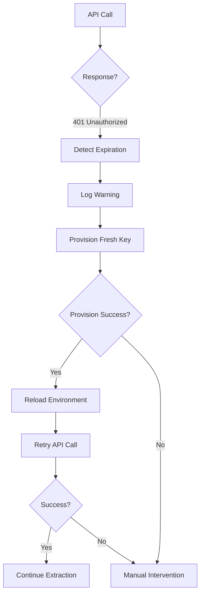

# API Key Management SOP

**Standard Operating Procedure for OpenRouter API Key Management**

## Overview

This toolkit implements automatic API key rotation for long-running extractions (20+ hours, 2,885 specimens). Keys auto-rotate on expiration to prevent data loss from authentication failures.

## Architecture

### Components

1. **Provisioning Script**: `~/devvyn-meta-project/scripts/provision-openrouter-key.sh`
   - Creates new OpenRouter API keys with configurable spending limits
   - Default: $15.00 per key
   - Stores keys in `~/Secrets/approved-for-agents/api-keys.env`

2. **Key Loading**: `~/Secrets/approved-for-agents/load_keys.py`
   - Loads approved API keys into environment (`os.environ`)
   - Imported by extraction scripts at startup

3. **Auto-Rotation Logic**: `scripts/extract_openrouter.py`
   - Detects 401 Unauthorized errors during extraction
   - Provisions fresh key automatically
   - Retries failed request with new key
   - Prevents infinite loops with `_key_rotated` flag

### Key Storage Security

**Location**: `~/Secrets/approved-for-agents/api-keys.env`

**Access Control**:
- File permissions: `600` (owner read/write only)
- Git-ignored via `~/.gitignore_global`
- Agent access logged via bridge protocol

**Key Format**:
```bash
# OpenRouter API - Multi-model gateway
export OPENROUTER_API_KEY="sk-or-v1-..."
```

## Automatic Key Rotation Workflow

### Normal Operation


### Key Expiration Handling



### Implementation Details

**Error Detection** (`call_openrouter()` in `scripts/extract_openrouter.py:182-254`):
```python
except requests.exceptions.HTTPError as e:
    if e.response.status_code == 401:  # Unauthorized
        if not _key_rotated:
            fresh_key = provision_fresh_api_key()
            if fresh_key:
                logger.info("🔄 Retrying with fresh API key...")
                return call_openrouter(messages, model, fresh_key, max_retries, _key_rotated=True)
```

**Key Provisioning** (`provision_fresh_api_key()` in `scripts/extract_openrouter.py:122-179`):
```python
def provision_fresh_api_key() -> Optional[str]:
    """Automatically provision fresh OpenRouter API key."""
    provision_script = Path.home() / "devvyn-meta-project/scripts/provision-openrouter-key.sh"

    result = subprocess.run(
        ["bash", str(provision_script), "--name", "auto-rotation", "--limit", "15.00"],
        capture_output=True, text=True, timeout=30
    )

    # Reload keys into environment
    from load_keys import load_api_keys
    load_api_keys()

    return os.environ.get("OPENROUTER_API_KEY")
```

**Loop Prevention**:
- `_key_rotated` flag passed recursively
- Only attempts rotation once per request
- Raises exception if fresh key also fails

## Manual Key Management

### Provisioning New Key

```bash
# Standard provisioning ($15 limit)
bash ~/devvyn-meta-project/scripts/provision-openrouter-key.sh \
    --name "herbarium-extraction" \
    --limit 15.00

# Higher limit for large batches
bash ~/devvyn-meta-project/scripts/provision-openrouter-key.sh \
    --name "full-dataset" \
    --limit 50.00
```

### Checking Key Balance

```bash
# View OpenRouter budget status
bash ~/devvyn-meta-project/scripts/openrouter-budget.sh
```

### Rotating Key Manually

```bash
# 1. Provision new key
bash ~/devvyn-meta-project/scripts/provision-openrouter-key.sh

# 2. Keys automatically loaded in new extraction runs
# No need to restart running processes (auto-rotation handles it)
```

## Monitoring and Logging

### Audit Trail

All key rotation events logged with timestamps:

```
2025-10-10 11:51:31 - WARNING - 🔑 API key expired/invalid - attempting auto-rotation...
2025-10-10 11:51:45 - INFO - ✅ New key provisioned successfully
2025-10-10 11:51:45 - INFO - ✅ Fresh key loaded: sk-or-v1-d41ba543056c...
2025-10-10 11:51:45 - INFO - 🔄 Retrying with fresh API key...
```

### Extraction Progress

Monitor ongoing extraction:

```bash
# Check specimen count
wc -l full_dataset_processing/openrouter_run_*/raw.jsonl

# Check success rate
jq 'select(.dwc)' full_dataset_processing/openrouter_run_*/raw.jsonl | wc -l
```

### Web Dashboard (Optional)

```bash
# Real-time monitoring (runs in background)
uv run python scripts/batch_web_dashboard.py --port 5000 --refresh 30

# Open in browser
open http://localhost:5000
```

## Failure Modes and Recovery

### Scenario 1: Provisioning Script Not Found

**Error**: `❌ Provisioning script not found: ~/devvyn-meta-project/scripts/provision-openrouter-key.sh`

**Resolution**: Verify meta-project installation
```bash
ls ~/devvyn-meta-project/scripts/provision-openrouter-key.sh
# If missing, clone meta-project repository
```

### Scenario 2: Fresh Key Also Fails (401)

**Error**: `❌ Fresh key also failed. Check OpenRouter service status.`

**Possible Causes**:
- OpenRouter service outage
- Credit card payment failure
- Account suspended

**Resolution**:
1. Check OpenRouter dashboard: https://openrouter.ai/dashboard
2. Verify payment method
3. Check service status: https://status.openrouter.ai

### Scenario 3: Provisioning Timeout

**Error**: `❌ Provisioning script timed out`

**Resolution**:
- Check network connectivity
- Verify OpenRouter API is accessible
- Try manual provisioning with verbose output

### Scenario 4: Key Provisioned But Not Loaded

**Error**: `❌ Key provisioned but not loaded into environment`

**Resolution**:
```bash
# Verify key file exists
cat ~/Secrets/approved-for-agents/api-keys.env

# Verify load_keys.py is accessible
python3 -c "import sys; sys.path.insert(0, '~/Secrets/approved-for-agents'); from load_keys import load_api_keys"
```

## Cost Management

### Budget Planning

| Model | Cost/Specimen | 2,885 Specimens | Key Limit |
|-------|---------------|-----------------|-----------|
| Qwen 2.5 VL 72B (FREE) | $0.00 | $0.00 | N/A |
| Qwen 2.5 VL 72B (Paid) | $0.0036 | $10.39 | $15.00 ✅ |
| Claude 3.5 Sonnet | $0.025 | $72.13 | $50.00 ❌ |

**Recommendation**: Use FREE models for initial testing, paid models for production quality.

### Key Rotation Frequency

**Typical Pattern**:
- 1 key = ~4,167 specimens @ $0.0036/specimen = $15.00
- 2,885 specimens = 1 key rotation (if using paid tier)
- FREE tier: No rotations needed (unlimited)

### Spending Limits

**Default**: $15.00 per key (conservative)
- Prevents runaway costs
- Allows 1-2 full extractions per key
- Auto-rotation provisions replacement automatically

**Custom Limits**:
```bash
# Lower limit for testing
--limit 5.00

# Higher limit for production
--limit 50.00
```

## Best Practices

### Development

✅ **DO**:
- Use FREE models for development/testing (qwen-vl-72b-free)
- Set conservative spending limits ($15 default)
- Monitor early validation results (first 5 specimens)
- Let auto-rotation handle key expiration

❌ **DON'T**:
- Hardcode API keys in source code
- Commit keys to git repositories
- Disable auto-rotation for long runs
- Use paid models without budget planning

### Production

✅ **DO**:
- Run extraction in background with nohup/tmux
- Stream results to disk immediately (`f.flush()`)
- Enable early validation (fail after 5 specimens if <50% success)
- Review environment snapshot for reproducibility

❌ **DON'T**:
- Run 22-hour extractions without monitoring
- Skip early validation checks
- Ignore 401 errors without investigation
- Delete raw.jsonl files before verification

## Environment Snapshot Integration

Each extraction saves environment snapshot for reproducibility:

```json
{
  "run_id": "openrouter_run_20251010_115131",
  "timestamp": "2025-10-10T22:33:36Z",
  "git": {
    "commit": "c070dca3ece257437ab8e54f1b8f71a6209d5274",
    "branch": "main",
    "dirty": true
  },
  "dependencies": {
    "requests": "2.32.5",
    "openai": "1.109.1"
  },
  "command": "scripts/extract_openrouter.py --input /tmp/imgcache --output ..."
}
```

**Location**: `full_dataset_processing/<run_id>/environment.json`

**Use Cases**:
- Reproduce extraction with exact dependencies
- Debug version-specific issues
- Track API changes over time

## Testing

Unit tests ensure SOP reliability:

**Test Coverage**:
- `tests/unit/test_environment.py` - Environment snapshot functionality
- Mock-based testing (no real API calls)
- Coverage: git info, package listing, file I/O, comparison

**Run Tests**:
```bash
uv run python -m pytest tests/unit/test_environment.py -v
```

## Related Documentation

- [OpenRouter Documentation](https://openrouter.ai/docs)
- [Environment Snapshot Module](../src/utils/environment.py)
- [Extraction Script](../scripts/extract_openrouter.py)
- [Meta-Project Key Provisioning](~/devvyn-meta-project/scripts/provision-openrouter-key.sh)

## Revision History

| Date | Version | Changes | Author |
|------|---------|---------|--------|
| 2025-10-10 | 1.0 | Initial SOP documentation | Claude Code |

## Support

**Issues**: https://github.com/devvyn/aafc-herbarium-dwc-extraction-2025/issues

**Internal**: See `.coordination/INTER_AGENT_MEMO.md` for multi-agent collaboration notes
