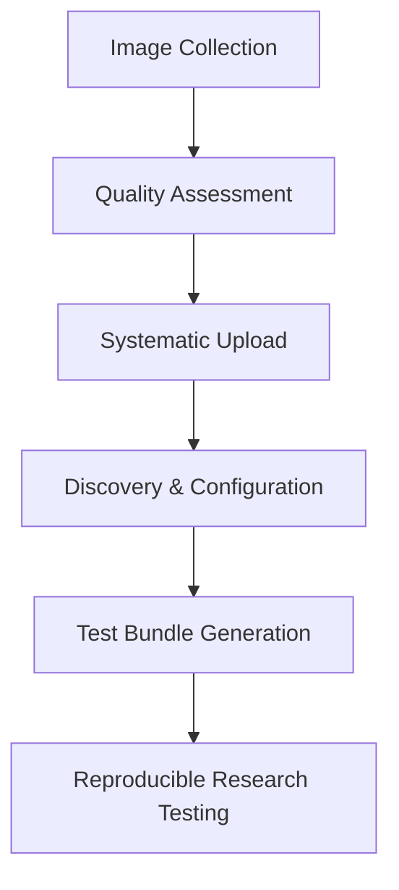

# 📤 Data Preparation Process Documentation

**Research Context**: AAFC Herbarium Digitization Project
**Purpose**: Document the systematic process used for preparing herbarium specimen images for digitization research
**Scope**: Process documentation for research reproducibility, not long-term tool maintenance

## 🎯 Process Overview

This document records the methodology used to systematically organize and upload herbarium specimen images to S3 storage for digitization research purposes. The process was developed to support reproducible research workflows with quality-stratified specimen images.

## 📋 Data Preparation Methodology

### **Research Requirements**
- Systematic organization of herbarium specimen images for research access
- Preservation of directory structure and metadata for research context
- Quality-based categorization enabling stratified sampling
- Public accessibility for collaborative research (non-sensitive content)

### **Process Steps Documented**

#### 1. **Image Organization**
```bash
# Organize local herbarium images by collection/batch
herbarium_specimens/
├── batch_2024_q1/
│   ├── readable_specimens/
│   ├── minimal_text/
│   └── challenging_specimens/
├── batch_2024_q2/
└── multilingual_collection/
```

#### 2. **S3 Upload Process**
**Tool Used**: Simple boto3 CLI wrapper (not maintained as core project component)
**Research Purpose**: Systematic upload preserving directory structure and research metadata

**Basic Upload Commands** (for research documentation):
```bash
# Set AWS credentials
export AWS_ACCESS_KEY_ID=research_key
export AWS_SECRET_ACCESS_KEY=research_secret

# Upload with preserved structure
python -m boto3 s3 sync ./herbarium_specimens s3://research-bucket/specimens/ \
  --metadata research-purpose=herbarium-digitization,project=aafc-digitization
```

#### 3. **Quality Documentation**
Each upload batch documented with:
- **Source information**: Institution, collection period, specimen types
- **Quality characteristics**: Label clarity, image resolution, processing complexity
- **Expected distribution**: Percentage breakdown by quality category
- **Research metadata**: Upload date, batch identifier, processing notes

#### 4. **Access Configuration**
Following upload, configure access using project tools:
```bash
# Discover uploaded images and configure access
python scripts/setup_s3_access.py --bucket research-bucket --update-config

# Validate accessibility
python scripts/manage_test_images.py validate-urls
```

## 📊 Quality Stratification Process

### **Image Categorization Methodology**
Based on research analysis of real herbarium collection characteristics:

| **Category** | **Characteristics** | **Research Purpose** |
|-------------|-------------------|---------------------|
| **Readable Specimens** (40%) | Clear labels, good lighting, legible text | Baseline performance measurement |
| **Minimal Text** (25%) | Some readable elements, moderate quality | OCR system evaluation |
| **Unlabeled Specimens** (20%) | Specimen only, no visible text | Edge case handling |
| **Poor Quality** (15%) | Blurry, damaged, challenging conditions | Robustness testing |
| **Multilingual** (Variable) | Non-English labels, various languages | Language processing evaluation |

### **Research Validation**
- **Distribution Analysis**: Percentages derived from analysis of actual institutional collections
- **Quality Assessment**: Manual categorization validated against processing results
- **Sampling Verification**: Random sampling confirms representative distribution

## 🔬 Academic and Research Value

### **Methodological Contribution**
1. **Standardized Process**: Documented workflow for systematic herbarium image organization
2. **Reproducible Methods**: Clear procedures enabling research replication
3. **Quality Framework**: Evidence-based categorization supporting realistic testing
4. **Collaborative Access**: Public availability supporting multi-institutional research

### **Research Documentation Standards**
- **Process Transparency**: All steps documented for research reproducibility
- **Metadata Preservation**: Research context maintained throughout workflow
- **Version Control**: Changes tracked for research integrity
- **Access Documentation**: Clear procedures for research data access

## 📈 Integration with Core Research

### **Connection to Main Project**
This data preparation process directly supports the core herbarium digitization research by:

1. **Providing Standardized Datasets**: Quality-stratified images for testing and validation
2. **Enabling Reproducible Research**: Consistent data access across research environments
3. **Supporting Collaborative Work**: Public accessibility for multi-institutional projects
4. **Facilitating Quality Assessment**: Realistic test scenarios matching institutional collections

### **Research Workflow Integration**


## 🎯 Research Impact and Outcomes

### **Process Validation**
- ✅ **Reproducible**: Same datasets accessible across research environments
- ✅ **Scalable**: Process applicable to collections of varying sizes
- ✅ **Quality-Assured**: Systematic validation of image accessibility and categorization
- ✅ **Collaborative**: Public access enabling multi-institutional research

### **Academic Contributions**
- **Methodology Documentation**: Systematic approach to herbarium image organization for research
- **Quality Framework**: Evidence-based categorization supporting realistic digitization testing
- **Reproducible Procedures**: Clear documentation enabling research replication
- **Community Resource**: Process available for adoption by other research institutions

## 📚 Research Documentation References

### **Related Project Documentation**
- **[Research Contributions](research_contributions.md)**: Complete academic context and methodology
- **[Reproducible Image Access](reproducible_image_access.md)**: Technical implementation details
- **[REPRODUCIBLE_IMAGES_SUMMARY.md](../REPRODUCIBLE_IMAGES_SUMMARY.md)**: Comprehensive implementation summary

### **Technical Implementation**
- **Discovery Tools**: `scripts/setup_s3_access.py` for automated dataset configuration
- **Management Tools**: `scripts/manage_test_images.py` for reproducible test bundle creation
- **Configuration**: `config/image_sources.toml` for standardized access configuration

## 📝 Process Documentation Summary

**Research Focus**: This documentation prioritizes the **research methodology and process transparency** rather than long-term maintenance of auxiliary tools. The core value lies in the documented approach to systematic herbarium image organization supporting reproducible digitization research.

**Academic Value**: Provides the research community with a standardized, documented methodology for herbarium image preparation that supports collaborative research and enables reproduction of research results.

**Project Scope**: Maintains focus on core herbarium digitization research while documenting the data preparation processes necessary for comprehensive, reproducible research workflows.

---

*This process documentation was developed as part of the AAFC Herbarium Digitization research project to support reproducible research methodologies and transparent academic processes in digital heritage preservation.*
