# Herbarium DWC Extraction

**Zero-cost, AI-powered digitization for herbarium collections**

Transform herbarium specimen photographs into structured biodiversity data ready for GBIF publication.

---

## :rocket: What is this?

Automatically extract Darwin Core metadata from herbarium specimen images using state-of-the-art vision AI:

```mermaid
graph LR
    A[📷 Specimen Photo] --> B[🤖 AI Extraction]
    B --> C[📊 Darwin Core CSV]
    C --> D[🌍 GBIF Publication]
```



**Input:** Herbarium specimen photograph
**Output:** Structured database record ready for biodiversity databases

---

## :sparkles: Why use this?

<div class="grid cards" markdown>

-   :moneybag: __Zero Cost__

    ---

    FREE models outperform paid APIs

    100% scientificName coverage at $0.00

-   :white_check_mark: __Production Ready__

    ---

    2,885 specimens extracted

    98%+ quality baseline achieved

-   :earth_africa: __GBIF Ready__

    ---

    Direct export to Darwin Core Archive

    Canadensys/IPT publication workflow

-   :microscope: __Scientifically Reproducible__

    ---

    Complete provenance tracking

    Git-based version control

</div>

---

## :zap: Quick Start

```bash
# Install
git clone https://github.com/devvyn/aafc-herbarium-dwc-extraction-2025.git
cd aafc-herbarium-dwc-extraction-2025
./bootstrap.sh

# Process specimens (FREE models)
uv run python scripts/extract_openrouter.py \
  --input photos/ \
  --output results/ \
  --model qwen-vl-72b-free

# Review and export
python review_web.py --db results/candidates.db --images photos/
python scripts/export_dwc_archive.py --input results/ --output dwc-archive/
```

[:octicons-arrow-right-24: Full installation guide](getting-started/installation.md)

---

## :newspaper: Latest Release: v1.1.0

**Multi-Provider Extraction with FREE Tier Support** (October 9, 2025)

### What's New

- **OpenRouter Integration** - Access 400+ vision models via unified API
- **FREE Tier Support** - Qwen 2.5 VL 72B achieves 100% scientificName coverage at $0 cost
- **Scientific Provenance** - Git-based reproducibility with SHA256 content addressing
- **Complete Documentation** - Comprehensive guides and research methodology

### Impact

| Provider | Coverage | Cost | Status |
|----------|----------|------|--------|
| OpenAI GPT-4o-mini | 98% | $10.55 | Baseline |
| **OpenRouter FREE** | **100%** | **$0.00** | **Winner** :trophy: |

[:octicons-tag-24: View release notes](about/changelog.md)

---

## :mag: How It Works

### Processing Pipeline

```python
from engines.openrouter import extract_specimen

# Extract Darwin Core data
result = extract_specimen(
    image_path="specimen_019121.jpg",
    model="qwen-vl-72b-free",
    api_key=os.getenv("OPENROUTER_API_KEY")
)

# Output
{
    "catalogNumber": "019121",
    "scientificName": "Bouteloua gracilis (HBK.) Lag.",
    "eventDate": "1969-08-14",
    "recordedBy": "J. Looman",
    "locality": "Beaver River crossing",
    "stateProvince": "Saskatchewan",
    "country": "Canada"
}
```

### Multi-Provider Architecture


[:octicons-book-24: Learn more about architecture](developer-guide/architecture.md)

---

## :chart_with_upwards_trend: Research Results

### Production Extraction (2,885 Specimens)

**Phase 1 Baseline (OpenAI GPT-4o-mini):**
- 98.0% scientificName coverage (490/500)
- 95.4% catalogNumber coverage (477/500)
- Cost: $1.85 per 500 specimens

**OpenRouter FREE (Qwen 2.5 VL 72B):**
- 100% scientificName coverage (20/20 validation)
- Better quality than paid baseline
- Cost: $0.00

!!! success "Key Finding"
    FREE open-source models (Qwen 2.5 VL 72B) outperform paid commercial APIs (GPT-4o-mini) for herbarium extraction.

[:octicons-graph-24: View quality analysis](research/quality.md)

---

## :books: Documentation

<div class="grid cards" markdown>

-   :material-rocket-launch: __Getting Started__

    ---

    Install, configure, and run your first extraction

    [:octicons-arrow-right-24: Installation guide](getting-started/installation.md)

-   :material-cog: __User Guide__

    ---

    Processing workflows, review interface, GBIF export

    [:octicons-arrow-right-24: User guide](user-guide/workflow.md)

-   :material-flask: __Research__

    ---

    Methodology, quality analysis, cost comparisons

    [:octicons-arrow-right-24: Research docs](research/methodology.md)

-   :material-code-braces: __Developer Guide__

    ---

    Architecture, API reference, contributing

    [:octicons-arrow-right-24: Developer docs](developer-guide/architecture.md)

</div>

---

## :busts_in_silhouette: Who Should Use This?

### :white_check_mark: Good Fit

- Herbarium digitization projects
- Biodiversity research institutions
- GBIF data publishers
- Natural history collections
- Budget-constrained digitization efforts

### :x: Not Suitable For

- Live plant identification (use iNaturalist)
- Specimens without readable labels
- Real-time field data collection

---

## :world_map: Use Cases

### Example: AAFC Herbarium Collection

**Challenge:** Digitize 2,885 herbarium specimens for GBIF publication

**Solution:** Multi-provider extraction with FREE models

**Results:**
- 100% scientificName coverage
- $0.00 total cost
- Complete provenance for scientific publication
- Ready for Canadensys IPT upload

[:octicons-arrow-right-24: View case study](research/methodology.md#aafc-use-case)

---

## :handshake: Contributing

We welcome contributions! This project demonstrates:

- Multi-provider AI architecture
- Scientific reproducibility patterns
- Zero-cost production workflows
- Institutional digitization at scale

[:octicons-git-pull-request-24: Contributing guide](developer-guide/contributing.md)

---

## :page_facing_up: License

MIT License - Free for research, commercial, and institutional use

[:octicons-law-24: View license](about/license.md)

---

## :compass: Quick Links

- [:material-github: GitHub Repository](https://github.com/devvyn/aafc-herbarium-dwc-extraction-2025)
- [:material-bug: Report Issues](https://github.com/devvyn/aafc-herbarium-dwc-extraction-2025/issues)
- [:material-notebook: Changelog](about/changelog.md)
- [:material-account-group: TDWG Darwin Core](https://dwc.tdwg.org/)
- [:material-earth: GBIF](https://www.gbif.org)

---

<div class="grid" markdown>
<div markdown>

### :rocket: Production Status

✅ 2,885 specimens extracted
✅ Ground truth validation complete
✅ GBIF publication workflow documented
✅ Multi-provider architecture shipped (v1.1.0)

</div>
<div markdown>

### :star: Project Stats


</div>
</div>

---

**Built for Agriculture and Agri-Food Canada (AAFC)**
*Enabling biodiversity data digitization at scale*
